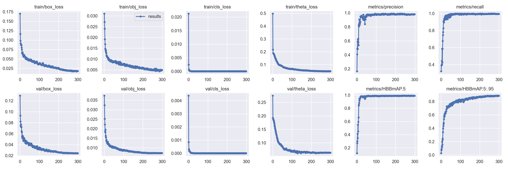

# Yolov5 for Oriented Object Detection

<!--  -->

The code for the implementation of “[Yolov5](https://github.com/ultralytics/yolov5) + [Circular Smooth Label](https://arxiv.org/abs/2003.05597v2)”. 

# Models and their results
## Models
#### The older dataset which was removed from this repo, but can be found at our [ROBOflow page](https://universe.roboflow.com/ukyaism/boxes_2-pwu7p) under the v2 BOXES_2 dataset
#### The newer dataset can be found at [FINAL_BOX](dataset/FINAL_BOX)  and can be found at our [ROBOflow page](https://universe.roboflow.com/ukyaism/boxes_2-pwu7p)
All of the hyperparameters can be found within the hyp.yaml file for each experiment

- The AISM original trained model was trained with the [yolov5s-OBB-orig.yaml](models/yolov5s-OBB-orig.yaml) configuration on an older dataset. It can be found under ['runs/train/exp93'](runs/train/exp93). 
- The Finetuned trained model was trained with the [yolov5s-OBB-orig.yaml](models/yolov5s-OBB-orig.yaml) on FINAL_BOX. It can be found under ['runs/train/exp158'](runs/train/exp158).
- The C3TR trained model was trained with the [yolov5s-OBB-C3TR.yaml](models/yolov5s-OBB-C3TR.yaml) on FINAL_BOX. It can be found under ['runs/train/exp156'](runs/train/exp156).
- The C3TRGhost trained model was trained with the [yolov5s-OBB-C3TRGhost.yaml](models/yolov5s-OBB-C3TRGhost.yaml) on FINAL_BOX. It can be found under ['runs/train/exp159'](runs/train/exp159).
- The C3STR trained model was trained with the [yolov5s-OBB-C3STR.yaml](models/yolov5s-OBB-C3STR.yaml) on FINAL_BOX. It can be found under ['runs/train/exp151'](runs/train/exp151).
- The C3STRGhost trained model was trained with the [yolov5s-OBB-C3STRGhost.yaml](models/yolov5s-OBB-C3STRGhost.yaml) on FINAL_BOX. It can be found under ['runs/train/exp155'](runs/train/exp155).

## Results
The results for our efforts can be found in the table below

| Models                | GFLOPs | mAP@.5 | mAP@.5:.95 |
|-----------------------|--------|--------|------------|
| Yolov5s-OBB-orig      | 17.3   | 99.5   | 81.515     |
| Yolov5s-OBB-finetuned | 17.3   | 98.947 | 87.563     |
| Yolov5s-OBB-C3TR      | 16.4   | 99.144 | 87.298     |
| Yolov5s-OBB-C3TRGhost | 14.0   | 99.312 | 87.096     |
| Yolov5-OBB-C3STR      | 57.2   | 99.118 | 88.622     |
| Yolov5s-OBB-C3STRGhost| 54.7   | 99.037 | 87.976     |

# [Updates]
- [2022/01/07] : **Faster and stronger**, some bugs fixed, yolov5 base version updated.
- [2023/12/15] : **Model Finalization**, trained and fine-tuned a model to detected objects and produce oriented bounding boxes 
- [2023/12/15] : **Increased Compatability**, added Windows compatability for yolov5_obb
- [2024/01/30] : **Peripheral Support**, added support for URX robot control 
- [2024/02/01] : **Increased Organization**, refactored the modules used to train and deploy the model
- [2024/02/15] : **Support**, added support for Windows
- [2024/03/28] : **Dataset Generation**, finished generation of 700+ image dataset
- [2024/04/08] : **Multi-Backbone Support**, added in modules for RFB and Coordinate Attention System
- [2024/04/08] : **Model Generation**, trained benchmark model on fine-tuned dataset
- [2024/04/25] : **Robotic Stacking Program**, fully realized computer vision and closed feedback program to drive autonomous robotic movement
- [2024/04/26] : **Swin Transformer Support**, added swin transformer to the modules for backbone modification
- [2024/04/28] : **Model Completion**, trained fine-tuned benchmark model and the rest of our configurations
- [2024/04/30] : **Increased Documentation**, documentation on results, setup and installation, as well as usage

# Installation
Please refer to [install.md](./docs/install.md) for installation and dataset preparation.

# Getting Started 
This repo is based on [yolov5](https://github.com/ultralytics/yolov5) and [yolov5_obb](https://github.com/bryceag11/yolov5_obb/tree/master)
And this repo has been rebuilt, Please see [GetStart.md](./docs/GetStart.md) for the Oriented Detection latest basic usage as some of the files may be redundant for intended usage and testing.

### Colab Link
   Try it out for yourself on [Google Colab](https://colab.research.google.com/drive/17O-lnAUde8zymxyNinIrggdXNslBQOlU?usp=sharing)

# Additional Information
  More information about the following folders can be found in their respective readme files:
  - [utils](./utils/README.utils.md)
  - [weights](./weights/README.weights.md)
  - [datasets](./dataset/FINAL_BOX/README.dataset.md)
  - [models](./models/README.models.md)
  - [runs](./runs/README.runs.md)

#  Acknowledgements
I have used utility functions from other wonderful open-source projects:

* [ultralytics/yolov5](https://github.com/ultralytics/yolov5).
* [Thinklab-SJTU/CSL_RetinaNet_Tensorflow](https://github.com/Thinklab-SJTU/CSL_RetinaNet_Tensorflow).
* [jbwang1997/OBBDetection](https://github.com/jbwang1997/OBBDetection)
* [CAPTAIN-WHU/DOTA_devkit](https://github.com/CAPTAIN-WHU/DOTA_devkit)
* https://github.com/anonymoussss/YOLOX-SwinTransformer/blob/master/yolox/models/swin_transformer.py

## Issues
If you have any problems during use, it is recommended to first check the environment dependencies according to [install.md](./docs/install.md) or [linux_install.md](./docs/linux_install.md), and then check whether the usage process is correct according to [GetStart.md](./docs/GetStart.md). 
