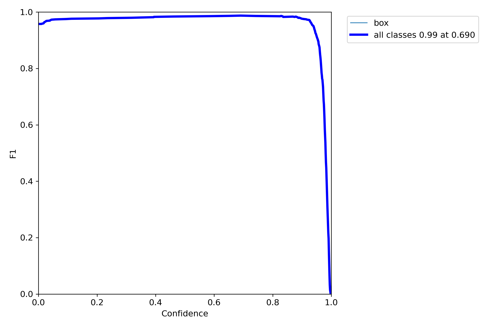

# Getting Started

This page provides basic usage about yolov5-obb. For installation instructions, please see [install.md](./install.md) or [linux_install](./linux_install.md).


## Project Execution
[YOLOV5obb](https://github.com/hukaixuan19970627/yolov5_obb/tree/master), or You Only Look Once (YOLO) Oriented Bounding Box is a computer vision model that is derived from Ultralytics’ [YOLOv5](https://github.com/ultralytics/yolov5). 
It implements oriented bounding box detection which rotate boxes to better fit objects represented on an angle. 
To detect objects, we must create features from input images and then feed the features through a prediction system to draw boxes around objects and predict their classes. 

The YOLO network consists of a backbone: a CNN aggregating and forming image features at various granularities, a neck: series of layers to mix and combine image features to pass them forward to prediction, and a head: which takes features from the neck and takes box and class prediction steps.

# Train a model

## Preparing dataset
**0. Prepare dataset using Roboflow**
Our original dataset can be found here: [AISMBoxes](https://universe.roboflow.com/ukyaism/boxes_2-pwu7p).

0.1 Create a new version of the dataset with your split, preprocessing steps, and any augmentation steps


0.2 Export the dataset with the YOLOv5 OBB structure


Labels format should be [poly classname difficult], e.g., we set **difficult=0**
```
  x1      y1       x2        y2       x3       y3       x4       y4       classname     diffcult

1309.0783 285.1795 1292.1972 405.3417 968.7130 390.9620 985.5957 270.8007 box 0
```

0.2 Move the file to the respective folder for usage 

0.3 File structure should resemble the structure below:
```
parent
├── yolov5
|── data
|   └── final_box.yaml
└── dataset
    └── FINAL_BOX
        ├── train
        ├── val
        └── test
            ├── images
                 |────1.jpg
                 |────...
                 └────10000.jpg
            ├── labelTxt
                 |────1.txt
                 |────...
                 └────10000.txt

```

In our case the .yaml file was moved to /data and the file name was changed to correspond to the dataset it was referencing.
Additionally change

0.4 Change the .yaml file appropriately
```
path: ./dataset/FINAL_BOX #TODO: Change this corresponding to where the dataset is located

train: train/images
val: valid/images
test: test/images

nc: 2
names: ['box', 'background']
```

**1. Prepare custom dataset files**

1.1 Make sure the labels format is [poly classname diffcult], e.g., You can set **diffcult=0**
```
  x1      y1       x2        y2       x3       y3       x4       y4       classname     diffcult

1686.0   1517.0   1695.0   1511.0   1711.0   1535.0   1700.0   1541.0   large-vehicle      1
```


1.2 Split the dataset. 
```shell
cd yolov5_obb
python DOTA_devkit/ImgSplit_multi_process.py
```
or Use the orignal dataset. 
```shell
cd yolov5_obb
```

1.3 Make sure your dataset structure same as:
```
parent
├── yolov5
└── dataset
    └── FINAL_BOX
        ├── train
        ├── val
        └── test
            ├── images
                 |────1.jpg
                 |────...
                 └────10000.jpg
            ├── labelTxt
                 |────1.txt
                 |────...
                 └────10000.txt

```

**Note:**
* DOTA is a high resolution image dataset, so it needs to be splited before training/testing to get better performance.

## Training
**2. Train**

2.1 Train with specified GPUs. (for example with GPU=3)

```shell
python yolo_train.py --device 3
```

2.2 Train with multiple(4) GPUs. (DDP Mode)

```shell
python -m torch.distributed.launch --nproc_per_node 4 yolo_train.py --device 0,1,2,3
```

2.3 Train the orignal dataset demo.
```shell
python yolo_train.py \
  --weights 'weights/yolov5n_s_m_l_x.pt' \
  --data 'data/final_box.yaml' \
  --hyp 'data/hyps/hyp.yaml' \
  --epochs 10 \
  --batch-size 1 \
  --img 1024 \
  --device 0
```
2.4 Additional details on parameters
```
--cfg # sets the model configuration, by default this is blank, using 'models/yolov5s-obb-C3STR.yaml'
will utilize the Swin Transformer architecture. Additional details on models can be found in that folder's README
--hyp sets the hyperparameters for the training of the model, these can be adjusted for each training example.
The selected hyperparameters will be output in the runs/train/exp for reference in retrospect
--weights can be configured for transfer learning by passing in previous model results 'best.pt' within the runs
```
# Inferenece with pretrained models. (Splited Dataset)
This repo provides the validation/testing scripts to evaluate the trained model.

Examples:

Assume that you have already downloaded the checkpoints to `runs/train/yolov5m_csl_dotav1.5/weights`.

1. Test yolov5-obb with single GPU. Get the HBB metrics.

```shell
python yolo_val.py \
 --data 'data/yolov5obb_demo_split.yaml' \
 --weights 'runs/train/yolov5m_csl_dotav1.5/weights/best.pt' \
 --batch-size 2 --img 1024 --task 'val' --device 0 --save-json --name 'obb_demo_split'

               Class     Images     Labels          P          R     mAP@.5 mAP@.5:.95: 100%|██████████| 3/3 [00:02<00:00,  1.09it/s]                                        
                 all          6         68      0.921      0.914      0.966      0.776
               plane          6         16      0.946          1      0.995      0.934
       small-vehicle          6         35      0.928      0.741      0.916      0.599
       large-vehicle          6         17       0.89          1      0.986      0.793
Speed: .................................................... per image at shape (2, 3, 1024, 1024)
...
Evaluating pycocotools mAP... saving runs/val/obb_demo_split/best_obb_predictions.json...
---------------------The hbb and obb results has been saved in json file-----------------------
```

2. Parse the results. Get the poly format results.
```shell 
python tools/TestJson2VocClassTxt.py --json_path 'runs/val/obb_demo_split/best_obb_predictions.json' --save_path 'runs/val/obb_demo_split/obb_predictions_Txt'
``` 

3. Merge the results. (If you split your dataset)
```shell
python DOTA_devkit/ResultMerge_multi_process.py \
    --scrpath 'runs/val/obb_demo_split/obb_predictions_Txt' \
    --dstpath 'runs/val/obb_demo_split/obb_predictions_Txt_Merged'
```

4. Get the OBB metrics
```shell
python DOTA_devkit/dota_evaluation_task1.py \
    --detpath 'runs/val/obb_demo_split/obb_predictions_Txt_Merged/Task1_{:s}.txt' \
    --annopath 'dataset/dataset_demo/labelTxt/{:s}.txt' \
    --imagesetfile 'dataset/dataset_demo/imgnamefile.txt'

...
map: 0.6666666666666669
classaps:  [100.   0. 100.]
```

# Inferenece with pretrained models. (Original Dataset)
We provide the validation/testing scripts to evaluate the trained model.

Examples:

Assume that you have already downloaded the checkpoints to `runs/train/exp151/weights/best.pt`.

1. Test yolov5-obb with single GPU. Get the HBB metrics.

```shell
python yolo_val.py \
 --data 'data/final_box.yaml' \
 --weights 'runs/train/exp151/weights/best.pt' \
 --task 'val' --device 0 --imgsz 630 

               Class     Images     Labels          P          R  HBBmAP@.5  HBBmAP@.5:.95: 100%|██████████| 23/23 [00:02<00:00,  8.14it/s]
                 all        178        433      0.982      0.995      0.991      0.886
                 box        178        433      0.982      0.995      0.991      0.886
Speed: 0.2ms pre-process, 5.3ms inference, 2.7ms NMS per image at shape (8, 3, 640, 640)
Results saved to runs\val\exp7

```


# Run inference on images, videos, directories, streams, etc. Then save the detection file.
1. image demo
```shell
python detect.py --weights 'runs/train/exp151/weights/best.pt' \
  --source 'dataset/final_box/test/images' \
  --img 830 --device 0 --conf-thres 0.8 --iou-thres 0.2 --hide-labels --hide-conf
```

# Data Analysis
The confusion matrix produced by the results requires 4 attributes:
* True positive: where the model predicts a label and matches correctly
* True negative: where the model does not predict a label where there is nothing to match
* False positive: where the model predicts a label where there is nothing to match
* False negative: where the model does not predict a label where there is something to match

The IoU, intersection over union, measures the overlap between 2 boundaries. It is used to measure how much a predicted boundary overlaps with the annotation or true boundary. The IoU threshold classifies whether a prediction is a true positive or false positive (match or incorrect matching). A higher IoU indicates the predicted box coordinates closely resemble the ground truth or annotated coordinates.

The precision measures how well you can find true positives out of all positive predictions or TPTP + FP. This varies on the confidence threshold of the model. Recall measures how well you can find true positives out of all predictions or TPTP + FN. 

Average precision is calculated as the weighted mean of precisions at each threshold, the weight is the increase in recall from the prior threshold. The mAP or mean average precision is the average of AP of each class. An mAP at .5 refers to the mean average precision at an IoU threshold of .5 while .95 is the precision at an IoU threshold of .95.


PR curve or precision-recall curve is obtained by plotting the model’s precision and recall values as a function of the model’s confidence score threshold. When a model has a high recall but low precision, the model classifies most of the positive samples correctly but has many false positives. When a model has high precision but low recall, it may only classify some of the positive samples. As the confidence score is decreased, more predictions are made (increasing recall), and fewer correct predictions are made (lowering precision). 



The F1 score is a single metric that combines both precision and recall into a single value. It is calculated as the harmonic mean of precision and recall, and it provides a balance between these two metrics. The F1 score reaches its best value at 1 (perfect precision and recall) and worst at 0.


The confusion matrix is a table that is often used to describe the performance of a classification model (or "classifier") on a set of test data for which the true values are known. It allows visualization of the performance of an algorithm, typically a supervised learning one. Each row of the matrix represents the instances in an actual class while each column represents the instances in a predicted class (or vice versa). The name stems from the fact that it makes it easy to see if the system is confusing two classes (i.e., commonly mislabeling one as another).


The precision curve, often referred to as the P curve, is a graphical representation of the precision (positive predictive value) of a classifier system as a function of the decision threshold. It is obtained by plotting precision values against different threshold values for a binary classification system. The precision indicates the proportion of positive identifications (or predicted positives) that were actually correct. The P curve helps assess the trade-off between precision and recall, providing insights into the classifier's performance across various decision thresholds.


The recall curve, also known as the R curve or sensitivity curve, is a graphical representation of the recall (true positive rate) of a classifier system as a function of the decision threshold. It is obtained by plotting recall values against different threshold values for a binary classification system. Recall measures the proportion of actual positive cases that were correctly identified by the classifier. The R curve helps evaluate the classifier's ability to detect all relevant instances of a class, providing insights into its sensitivity to different decision thresholds
